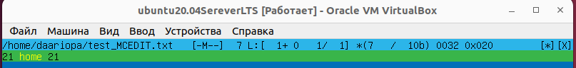

## **Part 1. Установка ОС**
---
**Установлена Ubuntu 20.04 Server LTS без графического интерфейса, используя программу для виртуализации - VirtualBox.**  
1. Версия Ubuntu:  `cat /etc/issue.`  
   

## **Part 2. Создание пользователя**  
---  
**Создан пользователь, отличный от пользователя, который создавался при установке. Пользователь был добавлен в группу adm.**  
2.1. Создан пользователь:  `sudo adduser user_2`   
    

2.2. Новый пользователь в выводе команды:  `cat /etc/passwd`  
   

2.3. Пользователь добавлен в группу adm: `sudo usermod -aG adm user_2`  
Просмотр информации о пользователях в группе adm: `getent group adm`  
  

## **Part 3. Настройка сети ОС**  
---  
3.1. Задано название машины вида user-1: 
 - `sudo hostnamectl set-hostname user-1`  
  
 - в файле также старое имя заменено на user-1 `sudo vim /etc/hosts`  
   

3.2. Установлена временная зона, соответствующая текущему местоположению: `sudo timedatectl set-timezone Europe/Moscow`   
   
 
3.3. Установлены `sudo apt install net-tools` и получены названия сетевых интерфейсов: `ifconfig`  
   
 - lo (loopback device) – виртуальный интерфейс, присутствующий по умолчанию в любом Linux. Он используется для отладки сетевых программ и запуска серверных приложений на локальной машине. С этим интерфейсом всегда связан адрес 127.0.0.1. и маску подсети 255.0.0.0. У него есть dns-имя – localhost.  

3.4. Получен ip адрес устройства от DHCP сервера:  
`sudo ip addr show`  или  `hostname -I`
   
  -  DHCP (англ. Dynamic Host Configuration Protocol — протокол динамической настройки узла) — сетевой протокол, позволяющий сетевым устройствам автоматически получать IP-адрес и другие параметры, необходимые для работы в сети TCP/IP.  

3.5. Определен внешний ip-адрес шлюза (ip): `wget -O - -q icanhazip.com`  
   
  и внутренний IP-адрес шлюза:  `ip rout show default`  
   

3.6. Заданы статичные настройки ip, gw, dns, с использованием публичного DNS сервера(1.1.1.1 или 8.8.8.8)  
 - Открываем файл: `sudo vim /etc/netplan/00-installer-config.yaml`  
  
 - Меняем `dhcp4:true` на `dhcp4:false` и прописываем статичные настройки ip, gw, dns (1.1.1.1 и 8.8.8.8)
   
 - Применяем внесенные изменения: `sudo netplan apply` и просматриваем новые маршруты в нашей системе: `ip route show`  
   

3.7. Виртуальная машина перезагружена `sudo reboot`  
   Проверено, что настройки соответствуют заданным в предыдущем пункте: `ifcongig` 
   
 и для DNS: `systemd-resolve --status`  
  

3.8. Пропингованы удаленные хосты 1.1.1.1 и ya.ru:  
`ping 1.1.1.1`  
     
`ping ya.ru` 
    

## **Part 4. Обновление ОС**
---  
4.1. Обновлены системные пакеты до последней версии:  
`sudo apt update` и `sudo apt upgrade`

4.2. Повторный ввод команды обновления системных пакетов: `sudo apt upgrade`  
   

## **Part 5. Использование команды sudo**
---  
5.1. Дано разрешение пользователю, созданному в Part 2, выполнять команду sudo: `sudo usermod -aG sudo user_2`  
 
 -  sudo (англ. Substitute User and do, дословно «подменить пользователя и выполнить») — программа для системного администрирования UNIX-систем, позволяющая делегировать те или иные привилегированные ресурсы пользователям с ведением протокола работы. Основная идея — дать пользователям как можно меньше прав, при этом достаточных для решения поставленных задач.  

5.2. Заменен hostname ОС от имени пользователя, созданного в пункте Part 2 (используя sudo)  
 - Cмена пользователя на user_2: `su user_2`  
 - Заменa hostname ОС от имени пользователя user_2 на user-2:`sudo hostnamectl set-hostname user-2`  
 - Проверка имени hostname: `hostname` 
 - В файле также старое имя заменено на user-2: `sudo vim /etc/hosts`  
   
 - Перезагрузка системы:  `sudo reboot`, для проверки изменения hostname  
  

 
## **Part 6. Установка и настройка службы времени**
---  
6.1. Настроена служба автоматической синхронизации времени
 - Установливаем пакет синхронизации времени ntp: `sudo apt-get install ntp`  
 - Запускаем `sudo systemctl start ntp`  
 - Установливаем утилиту для синхронизации времени `sudo apt install systemd-timesyncd`  
 - Cинхронизируем `timedatectl set-ntp true`  
 - Вывод времени и часового пояса, в котором сейчас нахожусь: `timedatectl show`  
  

## **Part 7. Установка и использование текстовых редакторов**
---  
7.1. Установлены текстовые редакторы VIM, NANO, MCEDIT
`sudo apt install nano` и `sudo apt install mcedit`  

7.2. В каждом редакторе, создан файл test_X.txt, где X -- название редактора
 - VIM: `sudo vim test_VIM.txt`  
 - NANO: `sudo nano test_NANO.txt`  
 - MCEDIT: `sudo mcedit test_MCEDIT.txt`  

7.3. Прописан никнейм(daariopa) в каждом файле и закрыт с сохранением изменений
 - VIM: 
 Переводим открытый файл в режим редактирования текста нажатием клавиши `i`, прописываем никнейм(daariopa).  
     
 Выходим из режима редактирования нажатием клавиши `Esc`закрываем файл, сохранив внесенные изменения `:wq`.  
 - NANO: Прописываем никнейм(daariopa). 
   
 Для сохранения изменений в файле используем команду `Ctrl+O` и для выхода `Ctrl+X`.  
 - MCEDIT: Прописываем никнейм(daariopa).  
   
 Для сохранения изменений в файле используем команду `F2` и для выхода `F10`.    

7.4. В каждом редакторе открыт файл на редактирование, заменив никнейм на строку "21 School 21" и закрыт файл без сохранения изменений
 - VIM: Переводим открытый файл в режим редактирования текста нажатием клавиши `i`, прописываем 21 School 21.  
   
 Выходим из режима редактирования нажатием клавиши `Esc`закрываем файл, не сохраняя изменения в файле `:q!`  
 - NANO: Прописываем 21 School 21.   
   
 Для выхода используем команду `Ctrl+X` и подтверждаем без сохранения изменений `n`  
 - MCEDIT: Прописываем 21 School 21.   
   
 Для выхода используем клавишу `F10` и подтверждаем без сохранения изменений выбирая клавишу `No`  

7.5. В каждом редакторе открыт файл на редактирование, файл отредактирован на строку "21 School 21", поиск по содержимому файла (21)
 - VIM: Для поиска по всему файлу использовала команду: `/21` 
   
 - NANO: Для поиска по всему файлу использовала команду: `Ctrl+W`. При нахождении совпадения курсор перемещается под совпадающий символ.  
   
 - MCEDIT: Для поиска по всему файлу использовала клавишу: `F7` и выбор клавиши `Find All`. При нахождении совпадения вся строка подсвчивается зеленым.  
   
 
7.6. Замена слова поиска(School) на  home
 - VIM: Для замены использована конструкция:`:%s/School/home/g` 
   
 - NANO: Сочетание клавиш `Alt+R` использовано для поиска(School) и замены(home) слов.
   
 - MCEDIT: Для поиска по всему файлу использовала клавишу `F7` и затем клавиша `F4`. Прописываем на какое слово заменяем и выбираем `Replace`.    
   

## **Part 8. Установка и базовая настройка сервиса SSHD**
---  
8.1. Установлена служба SSHd
 - Обновлен репозиторий командой: `sudo apt update`  
 - Установлен SSH с помощью команды: `sudo apt-get install ssh`  
 - Установлен OpenSSH:`sudo apt install openssh-server`  
 
8.2. Добавлен пакет SSH-сервера в автозагрузку: `sudo systemctl enable sshd`  
 - Проверена работа SSH: `systemctl status sshd `  
   

8.3. Перенастроена служба SSHd на порт 2022: 
 - Открываем конфигурационный файл в текстовом редакторе:`sudo vim /etc/ssh/sshd_config`  
 - В sshd_config заменяем порт 22 на 2022  
   
  - Чтобы изменения вступили в силу, перезапускаем SSH-сервер: `sudo systemctl restart sshd`  

8.4. Просмотр наличия процесса sshd: `ps -C sshd`  
   
 - Команда **ps** является очень гибким инструментом для определения работающих в системе программ и оценки используемых ими ресурсов. Она выводит статистику и информацию о состоянии процессов в системе, в том числе ИД процесса или нити, объем выполняемого ввода-вывода и используемый объем ресурсов процессора и памяти.
 Команда работает со следующими дополнительными ключами:   
 `ps -C` - поиск по имени процесса. 

8.5. Перезагрузка системы: `sudo reboot`  

8.6. Вывод команды `netstat -tan` содержит `tcp 0 0 0.0.0.0:2022 0.0.0.0:* LISTEN`   
   
 - Команда `netstat`  - показывает статистику приема и отправки пакетов, а также информацию об ошибках приема и отправки.
   - `-t` - показывать TCP порты.  
   - `-a` - позволяет просмотреть сведения о состоянии всех всех активных подключений и портов.    
   - `-n` - показывать сетевые адреса как числа(ip адрес). netstat обычно показывает адреса как символы. Эту опцию можно использовать с любым форматом показа.   
 - Значение каждого столбца вывода `netstat`:
   - `Proto` - протокол (tcp, udp, raw), используемый сокетом.
   - `Recv-Q` - количество байтов, не скопированных пользовательской программой, подключенной к этому сокету.
   - `Send-Q` - количество байтов, не подтвержденных удаленным хостом.
   - `Local Address` -  адрес и номер порта локального конца сокета. Если не указан параметр --numeric (-n), адрес сокета преобразуется в его каноническое имя хоста (FQDN), а номер порта преобразуется в соответствующее имя службы.
   - `Foreign Address` - адрес и номер порта удаленного конца сокета. Аналогичен «Локальному адресу».
   - `State` -  состояние socket. Состояние LISTEN означает, что сокет ожидает входящих подключений.
 - Значение `0.0.0.0` обозначает что сокет веб-сервера прослушивает любые доступные адреса.

## **Part 9. Установка и использование утилит top, htop**
---  
9.1. Установлены утилиты top и htop: `sudo apt install top/htop`  

9.2. Запущены утилиты top: `top` и htop: `htop` 

9.3. С помощью утилиты top определено: 
   
 - Uptime: `58 min`  
 - Количество авторизованных пользователей:`1`   
 - Общую загрузку системы(load avarage):`0.00, 0.00, 0.00`  
 - Общее количество процессов(Tasks): `91 total, 1 running, 90 sleeping, 0 stopped, 0 zombie`  
 - Загрузку cpu: `0,0 us, 0,3 su, 0,0 ni, 99,7 id, 0,0 wa, 0,0 hi, 0,0 si, 0,0 st`  
 - Загрузку памяти(Mib Mem): `965,1 total, 430,6 free, 124,4 used, 392.1 buff/cache`  
 - Pid процесса занимающего больше всего памяти `Shift+M` : `644`   
 - Pid процесса, занимающего больше всего процессорного времени`Shift+T` : `1052`  

9.4. С помощью утилиты команды htop получена информация о запущенных процессах, отсортированные `F6`:  
 - по PID:      
   
 - по PERCENT_CPU:   
  
 - по PERCENT_MEM:   
  
 - по TIME:      
  
 - отфильтрованному `F4` для процесса sshd:  
   
 - найденный процесс syslog, используя поиск `F3`:  
   
 - с добавленным выводом hostname, clock и uptime `F2`:  
   

## **Part 10. Использование утилиты fdisk**
---  
10.1. Запуск команды `sudo fdisk -l`  
   
   Отчет по команде `sudo fdisk -l`:  
 - Название жесткого диска:  `/dev/sda`
 - Размер жесткого диска:  `10GiB`
 - Количество секторов:  `20971520`
 - Размер swap, используя команду `swapon`:  `1.5G`

## **Part  11. Использование утилиты df**
---  
11.1.Запуск команды `df`  
   
Отчёт для корневого раздела (/):   
 - Размер раздела: `8408452`  
 - Размер занятого пространства: `4534256`  
 - Размер свободного пространства: `3425480`  
 - Процент использования: `57`   
 - Определена единица измерения в выводе: `1k-blocks`  

11.2. Запуск команды `df -Th`  
     
Отчёт для корневого раздела (/):  
 - Размер раздела: `8.1G`  
 - Размер занятого пространства: `4.4G`  
 - Размер свободного пространства: `3.3G`  
 - Процент использования: `57`  
 - Определен тип файловой системы для раздела: `ext4`   

## **Part 12. Использование утилиты du**
---  
12.1. Запуск команды `sudo du`  
   

12.2. Вывод размер папок /home, /var, /var/log.  
B байтах `sudo du -sb`:                     
   
B человекочитаемом виде `sudo du -sh`:     
  

12.3. Вывод размера всего содержимого в /var/log, используя *  
`sudo du -h /var/log/*`  
   

## **Part 13. Установка и использование утилиты ncdu**
---  
13.1. Установлена утилита ncdu  
`sudo apt install ncdu`  
   

13.2. Вывод размер папок:
 - `sudo ncdu /home`   
    
 - `sudo ncdu /var`  
      
 - `sudo ncdu /var/log`     
     

## **Part 14. Работа с системными журналами**
---  
14.1. Просмотрены:
- `tail /var/log/dmesg`  
   
- `tail /var/log/syslog`  
   
- `tail /var/log/auth.log` 
    
- `tail /var/log/auth.log | grep login` 
 
   - Время последней успешной авторизации: `Sep 10 21:49:15`  
   - Имя пользователя: `daariopa`   
   - Метод входа в систему: `systemd-login`    

14.2. Перезапуск службы SSHd `sudo service ssh restart`  
Cкрин с сообщением о рестарте службы `grep restart /var/log/auth.log` 
  

## **Part 15. Использование планировщика заданий CRON**
---  
15.1. Установка cron.
 - Перед установкой cron обновляем локальный индекс пакетов компьютера: `sudo apt update`  
 - Затем установливаем cron с помощью следующей команды: `sudo apt install cron`  
 - Также нужно убедиться, что он настроен для работы в фоновом режиме: `sudo systemctl enable cron`  
   

15.2 Используя планировщик заданий, запуск команды uptime через каждые 2 минуты.
 - Открывает конфигурационный файл: `crontab -e`  
 И прописываем запуск команды uptime через каждые 2 минуты: 
 `*/2 * * * * uptime`  
   
 - После ввода параметров сохраняем параметры редактора, нажав на клавишу `F2`, а затем покинуть конфигурационный файл - `F10`.  

15.3. Поиск в системных журналах строчки о выполнении:  
`tail /var/log/syslog`   
   

15.4. Вывод на экран список текущих заданий для CRON: `crontab -l`    
  

15.5. Удаление всех заданий из планировщика заданий и вывод на экран список текущих заданий для CRON: `crontab -l`    
    

