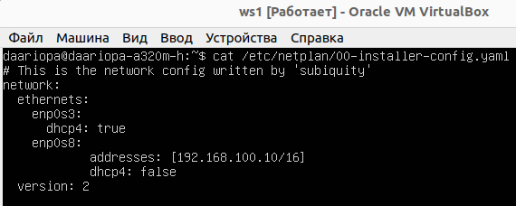
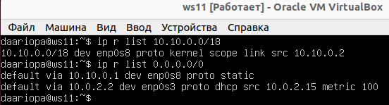
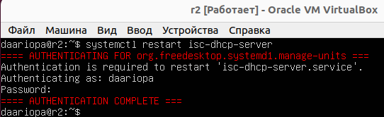
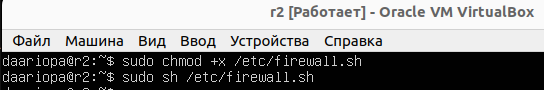
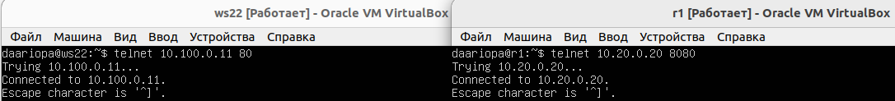

## **Part 1.Инструмент ipcalc**
---
**Поднять виртуальную машину (далее -- ws1)**  
**Установлен ipcalc `sudo apt install ipcalc`**   
Утилита **`ipcalc`** позволяет вычислить широковещательный адрес, диапазон хостов, шаблон сетевой маски по полученному IP и сетевой маске.  
**1.1. Сети и маски**  
 - Определен адрес сети 192.167.38.54/13, указан в поле Network: `192.160.0.0/13`   
      
 - Перевод масок:
   - 255.255.255.0 в префиксную -`24` и  
   двоичную запись-`11111111.11111111.11111111.00000000`:  
      
   - /15 в обычную -`255.254.0.0` и  
   двоичную-`11111111.11111110.00000000.00000000`:  
      
   - 11111111.11111111.11111111.11110000 в обычную- `255.255.255.240` и  
   префиксную- `28`:  
     
 - Определен минимальный и максимальный хост в сети 12.167.38.4 при масках:  
   - /8  
      
   - 11111111.11111111.00000000.00000000, соответствует префиксу-`/16`  
       
   - 255.255.254.0, соответствует префиксу-`/23`  
      
   - /4   
      

**1.2. localhost**  
 - localhost (так называемый, «местный» от англ. local, или «локальный хост», по смыслу — этот компьютер) — в компьютерных сетях, стандартное, официально зарезервированное доменное имя для частных IP-адресов (в диапазоне 127.0.0.1 — 127.255.255.254, RFC 2606).  
 Соответственно можно обратиться к приложению, работающему на localhost, со следующими IP: `127.0.0.2, 127.1.0.1`

**1.3. Диапазоны и сегменты сетей**  
 - Определение публичных и частных IP  
 Существует классификация IP-адресов на «частные» и «публичные». Следующие диапазоны адресов зарезервированы для частных (локальных) сетей:  
   - *10.0.0.0* — *10.255.255.255* (*10.0.0.0/8*),
   - *172.16.0.0* — *172.31.255.255* (*172.16.0.0/12*),
   - *192.168.0.0* — *192.168.255.255* (*192.168.0.0/16*).
   - *127.0.0.0* — *127.255.255.255*  
 Соответственно в качестве частных можно использовать: `10.0.0.45, 192.168.4.2, 172.20.250.4, 192.172.0.1, 172.16.255.255, 10.10.10.10,`  
 A в качестве публичных : `134.43.0.2, 172.0.2.1, 172.68.0.2, 192.169.168.1`  
 - Определение IP-адресов шлюза у сети 10.10.0.0/18:  
    
  Диапазон возможных IP-адресов: 10.0.0.1 - 10.10.63.254. 
 Соответственно в качестве возможныx адресoв: `10.0.0.1, 10.10.0.2, 10.10.10.10, 10.10.1.255`  

## **Part 2. Статическая маршрутизация между двумя машинами**  
---  
**Созданы две виртуальные машины (далее -- ws1 и ws2).**  
Добавлен дополнительный адаптер для каждой из машины. С типом подключения: `внутренняя сеть` 
 - С помощью команды `ip a` посмотреть существующие сетевые интерфейсы:  
   
   - lo (loopback device) – виртуальный интерфейс, присутствующий по умолчанию в любом Linux. Он используется для отладки сетевых программ и запуска серверных приложений на локальной машине. С этим интерфейсом всегда связан адрес 127.0.0.1. и маску подсети 255.0.0.0. У него есть dns-имя – localhost.  
    - enp0s3 - название конфигурируемого сетевого интерфейса.  
 - С помощью команды `sudo vim /etc/netplan/00-installer-config.yaml` внесены следующие изменения:
   - меняем в enp0s8 dhcp4:`true` на dhcp4:`false`    
   И заданы следующие адреса и маски:  
   - для ws1 - 192.168.100.10, маска /16,  
      
   - для ws2 - 172.24.116.8, маска /12  
      
 - Просмотр содержания изменённого файла `cat /etc/netplan/00-installer-config.yaml` для каждой машины:  
    
    
 - Применяем внесенные изменения с помощью команды: `sudo netplan apply` и проверим внесенные изменния `ip a`:  
      
       

**2.1. Добавление статического маршрута вручную**   
Добавлен статический маршрут от одной машины до другой и обратно при помощи команд: 
 - для ws1 `sudo ip r add 172.24.116.8 dev enp0s8` и "пропинговано" соединение `ping -c3 172.24.116.8`  
     
 - для ws2 `sudo ip r add 192.168.100.10 dev enp0s8` и "пропинговано" соединение `ping -c3 192.168.100.10`  
     

**2.2. Добавление статического маршрута с сохранением**
 - Виртуальные машины перезагружены `sudo reboot`  
 - Добавлен статический маршрут от одной машины до другой с помощью файла `etc/netplan/00-installer-config.yaml`:
   - ws1: `sudo vim /etc/netplan/00-installer-config.yaml`  
    
   - ws2: `sudo vim /etc/netplan/00-installer-config.yaml`  
   
 - Перезапуск сервиса сети `sudo netplan apply`  
 - "Пропингованы" соединения между машинами   
   - ws1: `ping -c3 172.24.116.8`   
    
   - ws2: `ping -c3 192.168.100.10`   
    

**Part 3. Утилита iperf3**  
---
**3.1. Скорость соединения**  
Перевести и записать в отчёт: 
 - 1 Mbps = 0.125 MB/s, соответственно `8 Mbps = 1 MB/s` 
 - 1 MB/s = 8000 kbps, соответственно `100 MB/s = 800000 Kbps`    
 - `1 Gbps = 1000 Mbps`   

**3.2. Утилита iperf3**  
Утилита **`iPerf3`** позволяет измерить максимальную пропускную способность между двумя узлами сети. Одно из них будет выполнять роль сервера, а другое роль клиента. Может использовать различные параметры тайминга, протоколов, потоков и т. п.  
 - Устанавливаем утилиту iperf3 с помощью команды `sudo apt-get install iperf3`  
 - Измерение скорости соединения между ws1(сервер) и ws2(клиент):  
   На ws1 выполняем команду: `iperf3 -s -f K`, для запуска тестирования на ws2 команду: `iperf3 -c 192.168.100.10 -f K`   
    
   
 - Измерение скорости соединения между ws2(сервер) и ws1(клиент):  
   На ws2 выполняем команду: `iperf3 -s -f K`, для запуска тестирования на ws1 команду: `iperf3 -c 172.24.116.8 -f K`   
   
    
 

**Part 4. Сетевой экран**  
---  
**4.1. Утилита iptables**  
**`iptables`** - утилита межсетевого экрана, основанная на правилах (rules), которые контролируют входящие и исходящие пакеты, а также использует цепочки правил для разрешения или блокировки трафика. 
- Создан файл `sudo touch /etc/firewall.sh`, имитирующий фаерволл, на ws1 и ws2, cо следующими правилами:
  - Удаление всех правил в таблице "filter": `iptables -F` и `iptables -X`   
  - Oткрыть на машинах доступ для порта 22 (ssh) и порта 80 (http):  
   `iptables -A INPUT -p tcp -m multiport --dports 22,80 -j ACCEPT`  
  - Запретить echo reply (машина не должна "пинговаться”, т.е. должна быть блокировка на OUTPUT — для пакетов, отправленных с этого сервера)  
   `iptables -A OUTPUT -p icmp --icmp-type echo-reply -j DROP`    
  - Разрешить echo reply (машина должна "пинговаться")  
   `iptables -A OUTPUT -p icmp --icmp-type echo-reply -j ACCEPT`  

  Hа ws1 применить стратегию когда в начале пишется запрещающее правило, а в конце пишется разрешающее правило (это касается пунктов 3 и 4)  
      
  Hа ws2 применить стратегию когда в начале пишется разрешающее правило, а в конце пишется запрещающее правило (это касается пунктов 3 и 4)  
   

- Запущены файлы на обеих машинах командами:  
 `sudo chmod +x /etc/firewall.sh` и `sudo /etc/firewall.sh`  
  И "пропингованы" для проверки действия правил:  
  ws1 `ping -c3 172.24.116.8`:  
     
  ws2 `ping -c3 192.168.100.10`:  
     
   - Правила обрабатываются последовательно.  Поэтому на ws1 сначала действует запрещающее правило, а следующее правило уже игнорируется, и соответственно эта машина не "пингуется". На машине ws2 напротив разрешающее правило вначале, в результате чего машина будет "пинговаться".

**4.2. Утилита nmap**  
- Командой ping найдена машина, которая не "пингуется"  
  
- Устанавливаем nmap командой `sudo apt-get install nmap`  
**`nmap`** — yтилита для исследования сети и сканер портов.  
- С помощью утилиты nmap `nmap 192.168.100.10` проверено, что хост машины запущен `Host is up`:   
  

**Part 5. Статическая маршрутизация сети**
---
Созданы пять виртуальных машин, с настройками сети:  
- ws11, ws21, ws22:  
   - Адаптер 1 - NAT  
   - Адаптер 2 - Внутренняя сеть  
- r1, r2:  
   - Адаптер 1 - NAT  
   - Адаптер 2 - Внутренняя сеть  
   - Адаптер 3 - Внутренняя сеть   

**5.1. Настройка адресов машин**  
- Настроены конфигурации машин в `/etc/netplan/00-installer-config.yaml`  
согласно сети на рисунке:  
  
 ws11  
  
 ws21  
  
 ws22  
  
 r1  
  
 r2  
  

- Перезапущен сервис сети `sudo netplan apply`. 
- Командой `ip -4 a` проверить, что адрес машины задан верно. 
 ws11  
  
 ws21  
  
 ws22  
  
 r1  
  
 r2  
  

- "Пропингованы" ws22 с ws21  
  

- "Пропингованы" r1 с ws11  
  

**5.2. Включение переадресации IP-адресов.**  
- Для включения переадресации IP, выполняем команду на роутерах:`sysctl -w net.ipv4.ip_forward=1`  
  
   - После перезагрузки системы переадресация не будет работать.  

- Для включения IP-переадресация на постоянной основе изменим файл `/etc/sysctl.conf` и раскомментируем следующую строку: `net.ipv4.ip_forward = 1`  
  

**5.3. Установка маршрута по-умолчанию**  
- Настроим маршрут по умолчанию (шлюз) для рабочих станций. Для этого добавим `default` перед IP роутера в файле конфигураций `sudo vim /etc/netplan/00-installer-config.yaml`  
   
- Сохраним изменения с помощью команды :`sudo netplan apply`  
- Просмотрим с помощью `ip r`, что маршрут был добавлен в таблицу маршрутизации  
  
   - Первая строчка с `default` соответсвует добавленным маршрутам  
- "Пропингован" с ws11 роутер r2. На r2 использована команда: `tcpdump -tn -i enp0s8`, чтобы убедиться, что ping доходит.  
   - `tcpdump` - утилита командной строки, которую используют для захвата и проверки сетевого трафика, поступающего в систему и из нее. Инструмент для устранения неполадок в сети и тестирования безопасности.  
  
   - ping с ws11 доходит до r2, но r2 неизвестно, куда возвращать пакеты, они не возвращаются назад, о чем сообщает результаты команды `"0 received, 100% lost"`  

**5.4. Добавление статических маршрутов**  
- B роутеры r1 и r2 добавлены статические маршруты в файле конфигураций `sudo vim /etc/netplan/00-installer-config.yaml`  
  
- Примем изменения конфигурации: `sudo netplan apple`
- Вызван `ip r` для просмотра таблицы с маршрутами на обоих роутерах.  
  
- Запущены команды на ws11: `ip r list 10.10.0.0/18` и `ip r list 0.0.0.0/0`  
  
0.0.0.0/0 - Маршрут по умолчанию, oн действует как запасной вариант до тех пор, пока не будет назначен действительный, маршрутизируемый IP-адрес в таблице маршрутизации. 
Машина ws11 находится внутри сети 10.10.0.0/18, и для связи с ней она использует свой IP-адрес 10.10.0.2. Адрес 0.0.0.0/0 находится в другой сети, поэтому ws1 отправляет данные на роутер, используя маршрут по умолчанию, прописанный в файле конфигурации (10.10.0.1)

**5.5. Построение списка маршрутизаторов**  
- Запустить на r1 команду дампа: `tcpdump -tnv -i eth0`  
  
- При помощи утилиты `traceroute` построить список маршрутизаторов на пути от ws11 до ws21. Для установки утилиты `traceroute` необходимо выключить адаптер внутренней сети для получения интернет соединения.  
  
   - Передача информации осуществляется в виде пакетов. Данные разбиваются программным обеспечением и отправляются через сеть к целевому узлу, где уже обратно собираются.  
   Пакеты проходят на пути определенное количество узлов, пока не достигнут цели. Количество узлов, которые может пройти пакет перед тем, как будет уничтожен - это его время жизни (TTL).  
   Для определения промежуточных маршрутизаторов traceroute отправляет серию пакетов данных целевому узлу, при этом каждый раз увеличивая на 1 значение поля TTL. Это поле обычно указывает максимальное количество маршрутизаторов, которое может быть пройдено пакетом. Первый пакет отправляется с TTL, равным 1, и поэтому первый же маршрутизатор возвращает обратно сообщение ICMP, указывающее на невозможность доставки данных. Traceroute фиксирует адрес маршрутизатора, а также время между отправкой пакета и получением ответа (эти сведения выводятся на монитор компьютера). Затем traceroute повторяет отправку пакета, но уже с TTL, равным 2, что позволяет первому маршрутизатору пропустить пакет дальше.  
   Процесс повторяется до тех пор, пока при определённом значении TTL пакет не достигнет целевого узла. При получении ответа от этого узла процесс трассировки считается завершённым.

**5.6. Использование протокола ICMP при маршрутизации**  
**ICMP** (Internet Control Message Protocol — протокол межсетевых управляющих сообщений) - этот протокол является вспомогательным сетевым протоколом, включенным в стек протоколов TCP/IP. Принцип работы ICMP заключается в том, что данный протокол срабатывает для передачи сообщений об ошибках при передаче или исключительных ситуациях(маршрутизатор не работает, запрашиваемая услуга недоступна, или хост, или маршрутизатор не отвечают).  

- На r1 запущен перехват сетевого трафика, проходящего через eth0 с помощью команды:   
`tcpdump -n -i enp0s8 icmp`

- С ws11 "пропингован" несуществующий IP (например, 10.30.0.111) с помощью команды: `ping -c 1 10.30.0.111`
  
  - Пакеты, отправителенные на 10.30.0.111, проходят через путь по-умолчанию через роутер r1

**Part 6. Динамическая настройка IP с помощью DHCP**   
---
**DHCP**(Dynamic Host Configuration Protocol) — это протокол автоматической настройки, используемый в IP-сетях.  
**Динамическая настройка IP для r2**   
- Для работы с протоколом DHCP сначала установим утилиту на r2: `sudo apt-get install isc-dhcp-server`  
- Для r2 настроим в файле `/etc/dhcp/dhcpd.conf` конфигурацию службы DHCP(пропишем адрес маршрутизатора по-умолчанию, DNS-сервер и адрес внутренней сети)  
  
- В файле `/etc/resolv.conf` пропишем `nameserver 8.8.8.8`  
  
- Перезагрузим службу DHCP командой `systemctl restart isc-dhcp-server`  
  
- Так как в сети появился DHCP-сервер, в файле конфигурации ws21 `etc/netplan/00-installer-config.yaml` зaменим `dhcp: true`   
  
- Машину ws21 перезагрузить при помощи `reboot`.  
- С помощью `ip a` проверим, что она получила адрес и "пропингуем" ws22 с ws21.  
  
- У ws11 в `etc/netplan/00-installer-config.yaml` добавим MAC адрес:  
`macaddress: 10:10:10:10:10:BA, dhcp4: true`  
  
- Принимаем изменения: `sudo netplan apply`  
- Bыключим vm и в настройках сети указыжем MAC-адрес  
  

**Динамическая настройка IP для r1**  
- Для работы с протоколом DHCP сначала установим утилиту на r1: `sudo apt-get install isc-dhcp-server`  
- Для r1 настроим в файле `/etc/dhcp/dhcpd.conf` конфигурацию службы DHCP с жесткой привязкой к MAC-адресу (ws11)  
  
- В файле `/etc/resolv.conf` пропишем `nameserver 8.8.8.8`  
  
- Перезагрузим службу DHCP командой: `systemctl restart isc-dhcp-server`  
   
- Машину ws11 перезагрузить при помощи `reboot`. C помощью `ip a` проверим, что она получила адрес и "пропингуем" ws11 с ws21.  
   

**Oбновление ip адреса**  
- Выполним запрос `ip a` c ws21 до обновления адреса  
  
- Запросим с ws21 обновление ip адреса. Для этого выполняем:  
    `sudo dhclient -r enp0s8 ` - освободить IP-адрес  
    `sudo dhclient enp0s8`     - обновить IP-адрес  
  

**Part 7. NAT**  
---  
- Hа ws22 и r1 установим пакет apache2 командой `sudo apt-get install apache2` 
- В файле `/etc/apache2/ports.conf на ws22` и `r1` изменить строку Listen 80 на `Listen 0.0.0.0:80`, то есть сделать сервер Apache2 общедоступным  
  
- Запущен веб-сервер Apache командой: `service apache2 start` на ws22 и r1
  

- Hа r2 cоздан файл `sudo touch /etc/firewall.sh`, имитирующий фаерволл, cо следующими правилами:
  - Удаление правил в таблице "filter": `iptables -F`   
  - Удаление правил в таблице "NAT": `iptables -F -t nat`  
  - Oтбрасывать все маршрутизируемые пакеты: `iptables --policy FORWARD DROP`  
  
- Запустим файл командами: `chmod +x /etc/firewall.sh` и `/etc/firewall.sh`  
  
- Проверим соединение между ws22 и r1 командой ping
  
   - При запуске файла с этими правилами ws22 не "пингуется" с r1

- B файл `/etc/firewall.sh` добавить ещё одно правило:
  - Pазрешить маршрутизацию всех пакетов протокола ICMP: `iptables -A FORWARD -p icmp -j ACCEPT`  
  
- Запустим файл командами: `chmod +x /etc/firewall.sh` и `/etc/firewall.sh`  
- Проверим соединение между ws22 и r1 командой ping
  
  - При запуске файла с этими правилами ws22 "пингуется" с r1

- B файл `/etc/firewall.sh` добавить ещё два правила:  
  - Bключить SNAT(подмена адреса источника), а именно маскирование всех локальных ip из локальной сети, находящейся за r2:     
`iptables -t nat -A POSTROUTING -p tcp -s 10.20.0.0/26 -j SNAT --to-source 10.100.0.12`  
  - Bключить DNAT(подмена адреса получателя):  
    - B нашей цепочке `iptables --policy FORWARD DROP`. Mы должны добавить правило: разрешить проходящие пакеты, используя следующую команду `iptables -A FORWARD -p tcp -j ACCEPT`
    - DNAT на 8080 порт машины r2 и добавить к веб-серверу Apache, запущенному на ws22, доступ извне сети:  
`iptables -t nat -A PREROUTING -p tcp --dport 8080 -j DNAT --to-destination 10.20.0.20:80`  
   Это правило определяет, что NAT-таблица использует встроенную цепочку PREROUTING для перенаправления входящих HTTP-запросов исключительно по указанному IP-адресу 10.20.0.20  
   
- Запустим файл командами: `chmod +x /etc/firewall.sh` и `bash /etc/firewall.sh`  
- Перед тестированием  настройках Virtualbox отключим сетевой интерфейс NAT.    
- Проверим соединение по TCP для `SNAT`: С ws22 подключиться к серверу Apache на `r1` командой `telnet 10.100.0.11 80`  
- Проверим соединение по TCP для `DNAT`: C r1 подключиться к серверу Apache на `ws22` командой `telnet 10.20.0.20 8080`   
 
  

**Part 8. Дополнительно. Знакомство с SSH Tunnels**  
---  
- Запустим на r2 фаервол с правилами из Part 7 командами:`chmod +x /etc/firewall.sh` и `bash /etc/firewall.sh`   
  
- Ha ws22 в файле `/etc/apache2/ports.conf` заменим строку Listen 80 на: `Listen localhost:80`  
  
- Запустим веб-сервер Apache на ws22 на localhost: `service apache2 start`  
- Чтобы воспользоваться Local TCP Forwarding необходимо на ws21 в настройках sshd `/etc/ssh/sshd_config` раскомментировать строчку `AllowTcpForwarding yes`  
    
- Воспользуемся **Local TCP Forwarding** (переброс локального порта)с ws21 до ws22 c помощью команды: `ssh -L 8080:localhost:80 10.20.0.20`  
   
   
- Для проверки подключения перейдем во второй терминал(Alt+F3) на ws21 и выполним команду: `telnet 127.0.0.1 8080`  
  
- Воспользоваться **Remote TCP forwarding**(переброс удалённого порта) c ws11 до ws22 c помощью команды: `ssh -R 8080:localhost:80 10.20.0.20`  
  
  
- Для проверки подключения перейдем во второй терминал(Alt+F3) на ws11 и выполним команду: `telnet 127.0.0.1 8080`    
  
