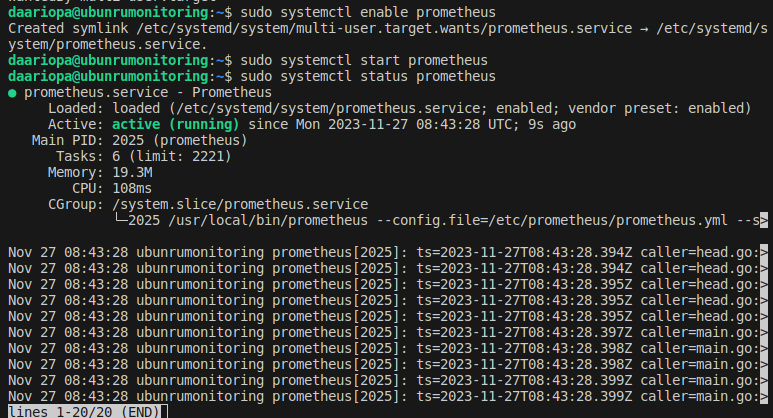
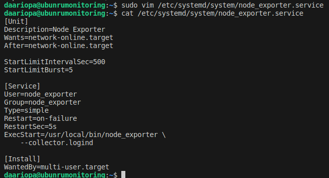
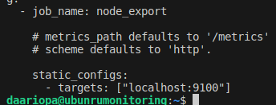
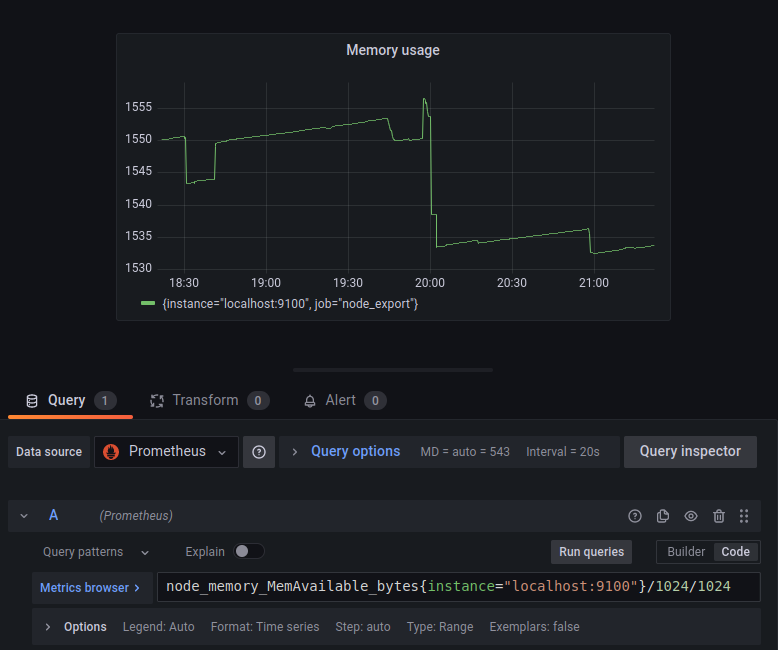

## **Prometheus и Grafana**
 **Установка Prometheus**
1. Создание системного пользователя:  
    `sudo useradd --system --no-create-home --shell /bin/false prometheus`

2. Скачать и извлечь Prometheus:  
    `wget https://github.com/prometheus/prometheus/releases/download/v2.32.1/prometheus-2.32.1.linux-amd64.tar.gz`

   `tar -xvf prometheus-2.32.1.linux-amd64.tar.gz` 

3. Создать директорию данных для Prometheus и переместить туда распакованные файлы:  
    `sudo mkdir -p /data /etc/prometheus`

    `cd prometheus-2.32.1.linux-amd64`

    `sudo mv prometheus promtool /usr/local/bin/`

    `sudo mv prometheus.yml /etc/prometheus/prometheus.yml`

4. Чтобы избежать проблем с правами доступа, необходимо правильно указать владельца для каталога /etc/prometheus/ и каталога данных:  
    `sudo chown -R prometheus:prometheus /etc/prometheus/ /data/`

5. Проверяем успешность установки Prometheus и удаляем ненужный больше архив и папку:  
    `prometheus --version`

    `cd ..`

    `rm -rf prometheus*`

6. Для использования systemd, системный и сервисный менеджер для операционных систем Linux, необходимо создать файл конфигурации модуля systemd:  
    `sudo vim /etc/systemd/system/prometheus.service`

  

7. Запускаем Prometheus:  
    `sudo systemctl enable prometheus`

    `sudo systemctl start prometheus`

    `sudo systemctl status prometheus`  

 

**Настройка Node Exporter:**  

1. Создан системный пользователь:  
    `sudo useradd --system --no-create-home --shell /bin/false node_exporter`   

2. Загружено средство экспорта узлов:  
    `wget https://github.com/prometheus/node_exporter/releases/download/v1.3.1/node_exporter-1.3.1.linux-amd64.tar.gz`   

3. Извлечение:  
    `tar -xvf node_exporter-1.3.1.linux-amd64.tar.gz`  

4. Переместите и очистите файлы:  
    `sudo mv node_exporter-1.3.1.linux-amd64/node_exporter /usr/local/bin/`  
    `rm -rf node_exporter*`  

5. Проверка установки:  
    `node_exporter --version`  

6. Для использования systemd, системный и сервисный менеджер для операционных систем Linux, необходимо создать файл конфигурации модуля systemd:  
    `sudo vim /etc/systemd/system/node_exporter.service`  
   
 
7. Запуск Node Exporter  
    `sudo systemctl enable node_exporter`

    `sudo systemctl start node_exporter`

    `sudo systemctl status node_exporter`

   

8. Создание статическую цель для Node Exporter:  
    `sudo vim /etc/prometheus/prometheus.yml`  
  

**Устатновка Grafana**  

1. Установить зависимости: 
    `sudo apt-get install -y adduser libfontconfig1 musl`  
    `sudo apt-get install -y apt-transport-https software-properties-common`  

2. Добавить ключ GPG:  
    `wget https://dl.grafana.com/enterprise/release/grafana-enterprise_10.2.2_amd64.deb`  

    `sudo dpkg -i grafana-enterprise_10.2.2_amd64.deb`  

3. Запустите Grafana:  
    `sudo systemctl enable grafana-server`  

    `sudo systemctl start grafana-server`  

    `sudo systemctl status grafana-server`   

   

**Сетевой мост**  

1. В настройках виртуальной машины добавить 2 адаптер c `Сетевой мост`  

2. Запустить виртуальную машину:  
    

   `sudo vim /etc/netplan/00-installer-config.yaml`  
     
   `sudo netplan apply`   
  
     
     - Получен ip для сетевого моста: `192.168.0.103`  

3. Соединяем виртуальную машину с компьтером:  
`ssh -L 9090:localhost:9090 -L 3000:localhost:3000 daariopa@192.168.0.103` 
 - 9090-порт Prometheus  
 - 3000-порт Grafana  

**Доступ к веб интерфейсам Prometheus и Grafana с локальной машины** 

1. Чтобы перейти в панель Prometheus используя браузер перейдем по адресу нашего сервера с установленной Prometheus http://192.168.0.103:9090 
   
Чтобы перейти в панель Grafana используя браузер перейдем по адресу нашего сервера с установленной Graphana http://192.168.0.103:3000  
При первом запуске вводим логин: admin и пароль: admin.   
После этого перейдем `Configuration->Data Source` и нажимаем кнопку `Add Data Source`  
В открывшемся окне выбираем тип `Data Source - Prometheus`  
В поле URL вводим адрес сервера, на котором доступен Prometheus и его порт, используем http://192.168.0.103:9090  
Сохраняем изменения `Save and Test` для проверки соединения.  
   

**Настройка дашбордов Grafana**  

Добавлены метрики (ЦП, доступная оперативная память, свободное место и количество операций ввода-вывода на жестком диске):    
- CPU   
  
- Memory usage  
  
- Disk usage  
  
- Disk I/O  
  
- Конечный результат  
  

**Запуск скрипта из второй части**  
  

**Утилита stress**  
Установлена утилита stress:  
`sudo apt install -y stress`  
Запуск команды stress `-c 2 -i 1 -m 1 --vm-bytes 32M -t 10s`  
  
 
