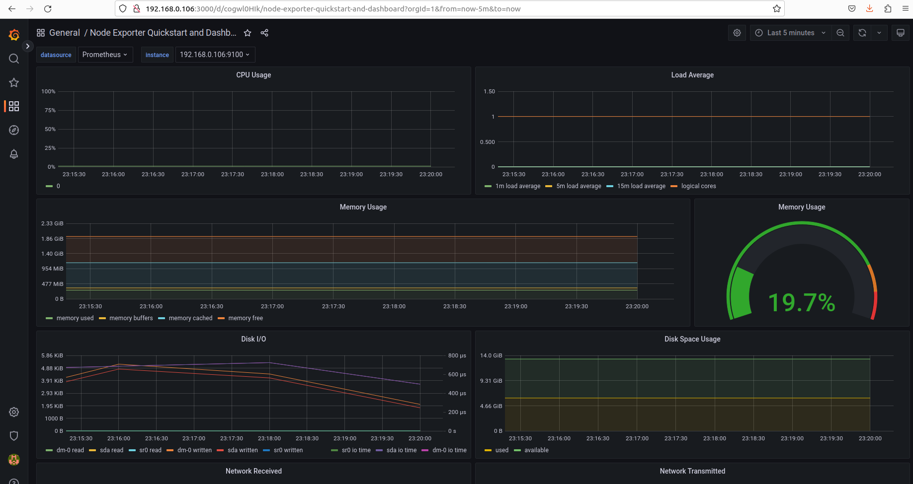
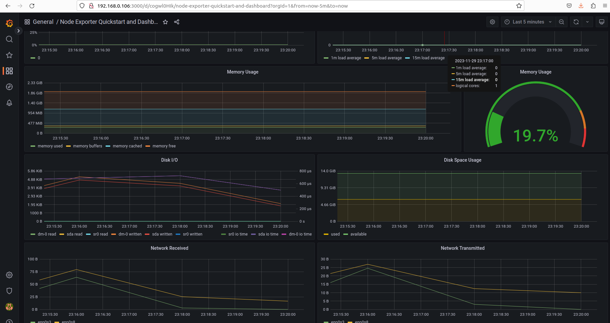
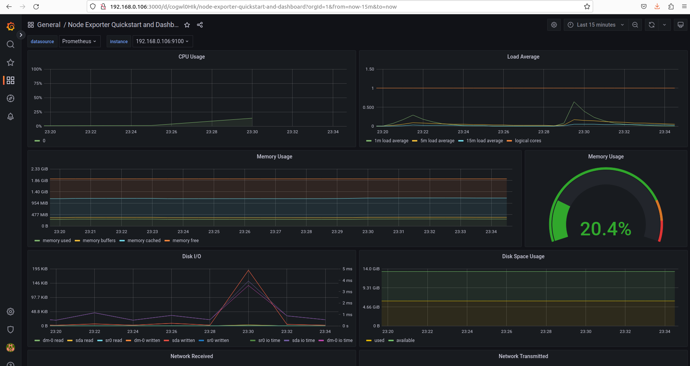
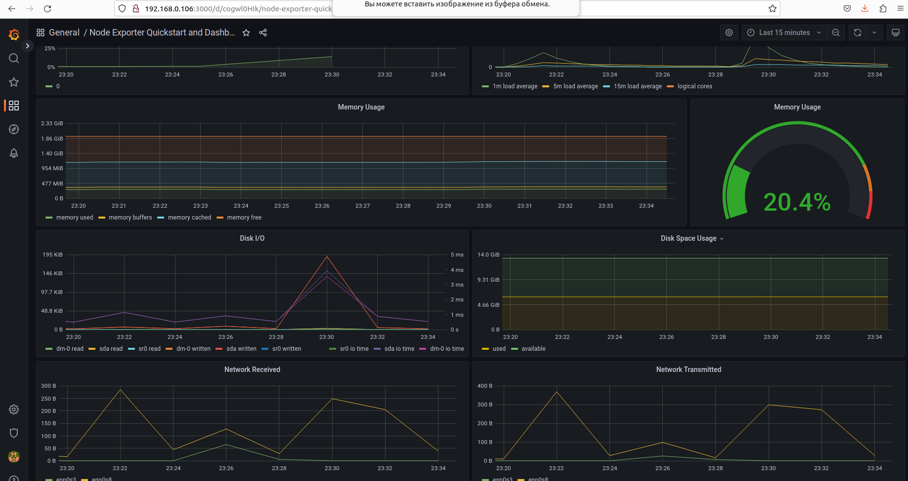
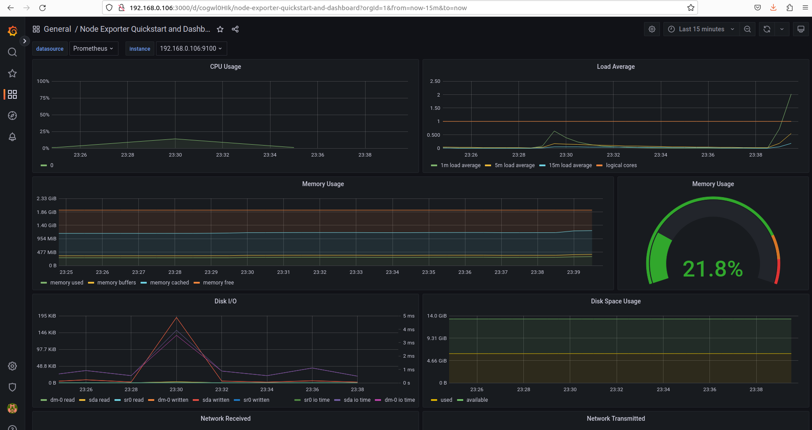
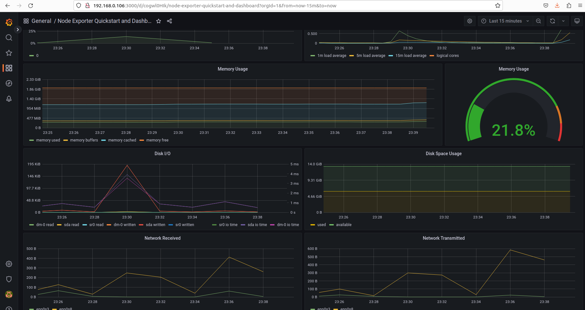
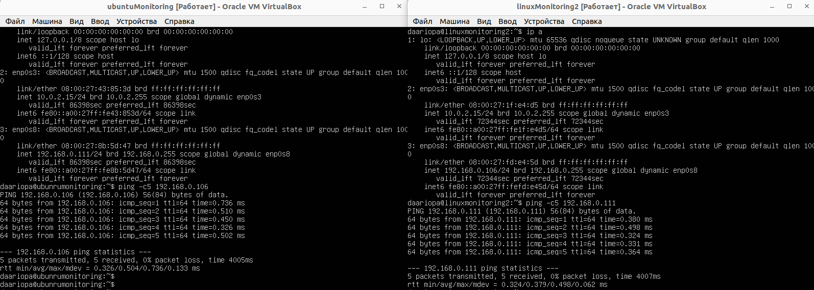
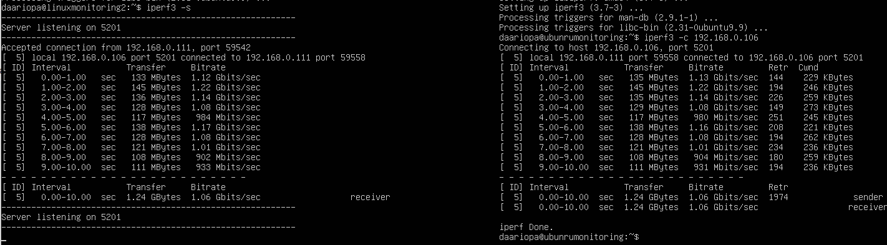
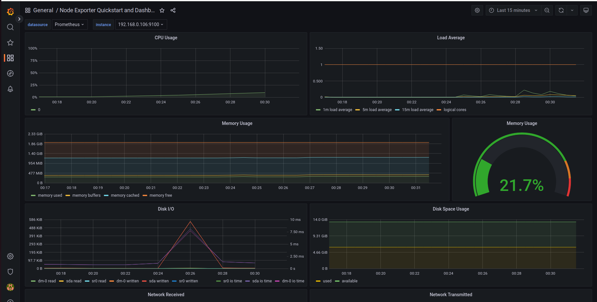
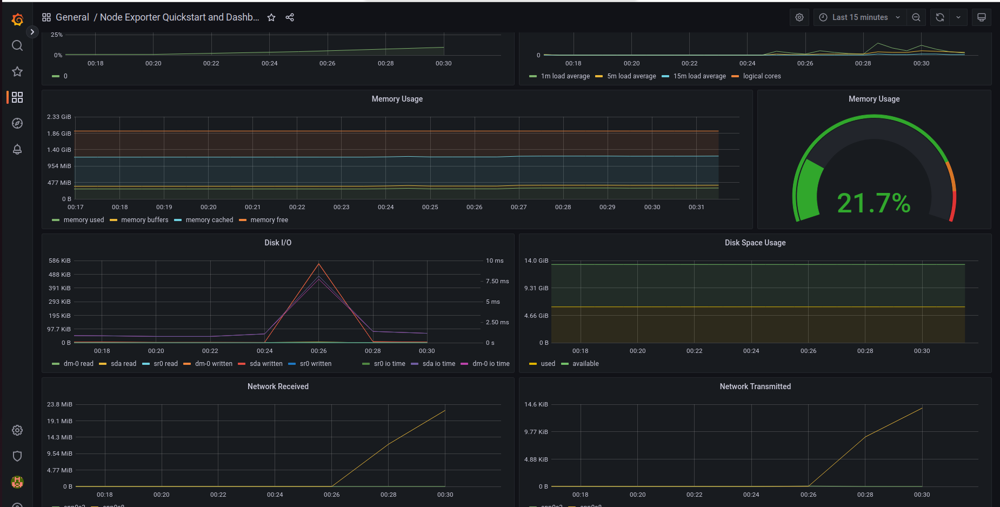

## **Дашборд Node Exporter Quickstart and Dashboard**  

1. Скачан код готового дашборда Node Exporter Quickstart and Dashboard с официального сайта Grafana Labs сайта https://grafana.com/grafana/dashboards/13978-node-exporter-quickstart-and-dashboard/   
- Добавлен дашборд в Grafana: `Dashboards->Manage->Import и вставить скачанный код`  
 
 

2. Проведены тесты из Части 7  
 - Запущен bash-скрипт из Part 2 и на скриншоте видим нагрузку жесткого диска part_8 
 
  
 - Использована командa утилит stress
   `stress -c 2 -i 1 -m 1 --vm-bytes 32M -t 60s`
  
  

3. Проверка результатa работы part_8  
 - Создана вторая виртуальная машина со вторым адаптером-сетевой мост,  и проверены на ping

 - Запущен тест нагрузки сети с помощью утилиты `iperf3`:  
    - Первая машина выступает в роли сервера, используем команду: `iperf3 -s`  
    - Вторая машина выступает в роли клиента, используем команду: `iperf3 -c 192.168.0.106`  
   
 - Посмотрим на нагрузку сетевого интерфейса  
   
 
