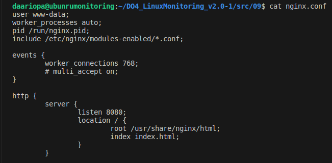
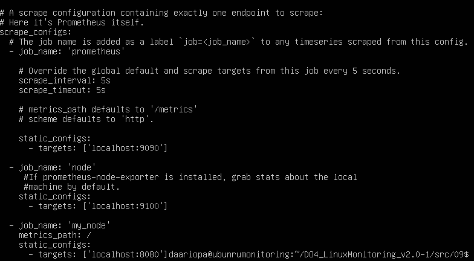
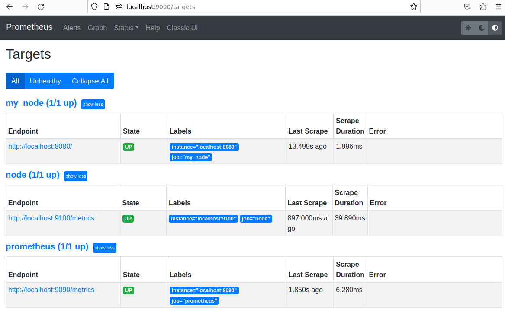
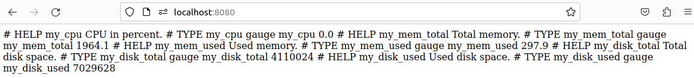
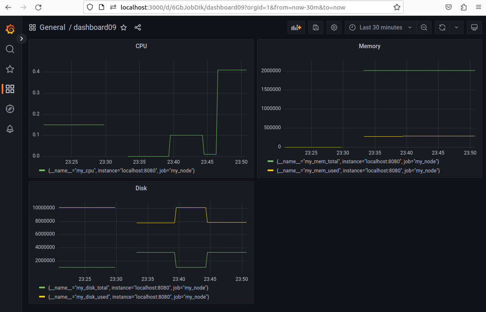
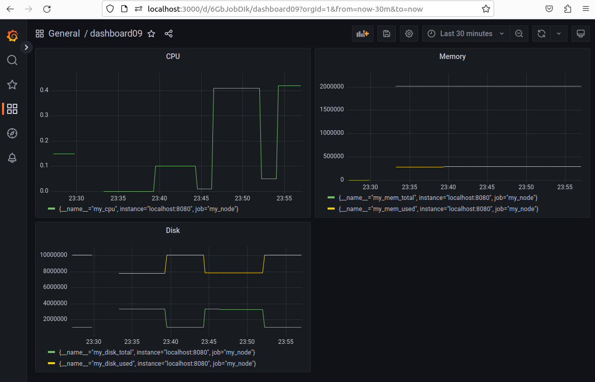

## **My node_exporter**

- Написаны bash-скрипты:   
   - `gen_info.sh`, который собирает информацию по базовым метрикам системы (ЦПУ, оперативная память, жесткий диск (объем)).   
   - `main.sh` для установки nginx, редактирования конфигурационных файлов Prometheus и nginx. Скрипт формирует html-страницу index.html по формату Prometheus, которую будет отдавать nginx. Страница обновляется внутри bash-скрипта main.sh в цикле каждые 3 сек.  

- Соединяем виртуальную машину с компьтером:  
`ssh -L 9090:localhost:9090 -L 3000:localhost:3000 -L 8080:localhost:8080 daariopa@192.168.0.103`  
- Запустим скрипт и проверим, изменения в конфигурационных файлах:  
nginx.conf:  
  
рrometheus.yml:  
  
- Проверяем, что по адресу http://localhost:9090/ (Prometheus) появился новый источник данных   
  
- Проверяем, что по адресу http://localhost:8080/ nginx сервер отдает html-страницу с новыми метриками  
  
- Переходим по адресу http://localhost:3000/ (Grafana) и создаем новый дашборд с использованием собственных метрик  
- Запускаем bash-скрипт из Части 2  
  
- stress -c 2 -i 1 -m 1 --vm-bytes 32M -t 60s  
  

