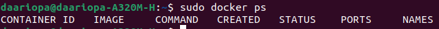
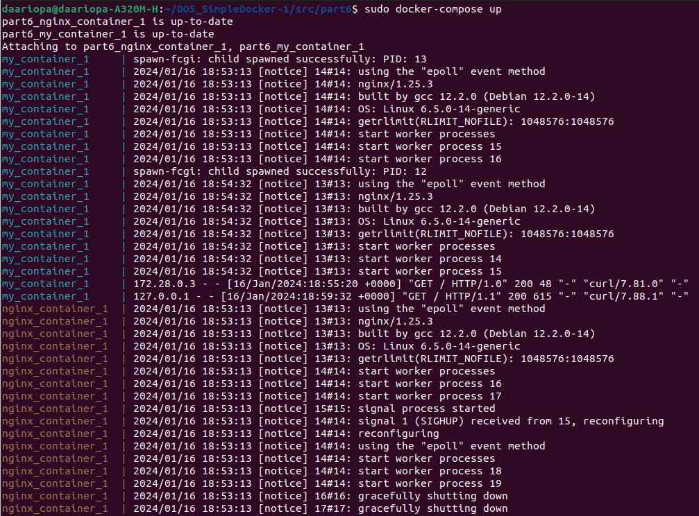
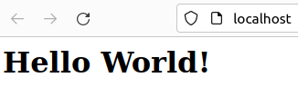

## Part 1. Готовый докер  

- Установим Docker с помощью скрипта с официального сайта (https://docs.docker.com/engine/install/ubuntu/):  
  - `curl -fsSL https://get.docker.com -o get-docker.sh`  
  - `sudo sh get-docker.sh`  
    

- Возьмем официальный докер образ с nginx и выкачам его при помощи `sudo docker pull nginx`   
    

- Проверим наличие докер образа через `sudo docker images`  
    

- Запустим докер образ через `docker run -d [image_id|repository]`  
    

- Проверим, что образ запустился через `sudo docker ps`  
    

- Посмотрим информацию о контейнере через `sudo docker inspect [container_id|container_name]`  
  Вывод команды очень большой, поэтому используем `grep` для получения размера контейнера, списка замапленных портов и ip контейнера  
    

- Остановливаем докер образ через `sudo docker stop 55c5c5b8b3fe`  
    

- Проверим, что образ остановился через `sudo docker ps`  
    

- Запустим докер с портами 80 и 443 в контейнере, замапленными на такие же порты на локальной машине, через команду run  
`sudo docker run -d -p 80:80 -p 443:443 nginx`  
    

- Проверим, что в браузере по адресу localhost:80 доступна стартовая страница nginx `open http://localhost:80`  
    

- Перезапустим докер контейнер через `docker restart 0c44b2de07d5`  
    

- Проверим, что контейнер запустился `sudo docker ps`  
    

## Part 2. Операции с контейнером
- Прочитать конфигурационный файл nginx.conf внутри докер контейнера через команду exec   
`sudo docker exec 0c44b2de07d5 cat /etc/nginx/nginx.conf`  
    

- Создадим на локальной машине файл nginx.conf и скопируем в него содержимое конфигурационного файла контейнера:  
  `touch nginx.conf`   
  `docker exec 0c44b2de07d5 cat /etc/nginx/nginx.conf > nginx.conf`  

- Настроим в nginx.conf по пути /status отдачу страницы статуса сервера nginx  
    

- Скопируем созданный файл nginx.conf внутрь докер образа через команду docker cp  и перезапустим nginx внутри докер образа через команду exec  
  `sudo docker cp nginx.conf 0c44b2de07d5:etc/nginx/nginx.conf`   
  `sudo docker exec 0c44b2de07d5 service nginx -s reload`   
    

- Проверим, что по адресу localhost:80/status отдается страничка со статусом сервера nginx   
`open http://localhost:80/status`
    

- Экспортируем контейнер в файл container.tar через команду export и oстановим контейнер   
`sudo docker export 0c44b2de07d5 > container.tar`   
`sudo docker stop 0c44b2de07d5`  
    

- Удалим образ через `sudo docker rmi -f 2a36393edaf1`, не удаляя перед этим контейнеры, добавив флаг -f (--force):
    

- Удалим остановленный контейнер  
`sudo docker rm 0c44b2de07d5`  
    

- Импортируем контейнер обратно через команду import и запустим импортированный контейнер  
`sudo docker import -c 'CMD ["nginx", "-g", "daemon off;"]' container.tar`  
`sudo docker run -d -p 80:80 -p 443:443 1fc89164a0d4`  
    
    - ["nginx", "-g", "daemon off;"] гарантирует, что Nginx останется «на переднем плане», так что Docker сможет правильно отслеживать процесс (в противном случае контейнер остановится сразу после запуска)

- Проверим, что по адресу localhost:80/status отдается страничка со статусом сервера nginx  
`open http://localhost:80/status`  
    

## Part 3. Мини веб-сервер

- Создадим папку server, а в ней файлы server.c и nginx.conf  
    
    
  
- Скачаем nginx образ, запустим контейнер с настроенными портами 
    

- Копируем nginx.conf, server.c в докер
    

- Проверим наличие скопированных файлов  
    

- Заходим в контейнер  
`sudo docker exec -it bc652c873e66 bash`  
и сделаем установку необходимых пакетов: spawn-fcgi, gcc, libfcgi-dev  
`apt-get install -y gcc spawn-fcgi libfcgi-dev`  
 
- Компиляция файла server.c и запуск его через spawn-fcgi  
    

- Перезагрузка контейнера и проверка страницы в браузере  
    
       

- Перекидываем по заданию nginx.conf в папку nginx  
     
 

## Part 4. Свой докер  

- Напишем свой докер образ  
Создаем папку рart4 и в ней файл Dockerfile,а в нем создаем докер-образ:  
    

- В папке рart4 напишем скрипт `run_server.sh`, который будет собирать образ и запускать его на 8080 порту  
    

- Собраем  написанный докер образ через docker build при этом указав имя и тег  
`sudo docker build . -t mydocker:part4`  
    

- Проверим через `sudo docker images`, что все собралось корректно  
    

- С помощью команды docker run запускаем наш собранный докер и делаем маппинг папки nginx `sudo docker run -it --name my_container -p 80:81 -v /home/daariopa/DO5_SimpleDocker-1/src/part4/nginx/nginx.conf -d mydocker:part4 bash` 
    

- С помощью команды `curl http://localhost:80` и `open http://localhost:80` проверяем, что страничка доступна  
    
    

- Допишем в ./nginx/nginx.conf проксирование странички /status, по которой надо отдавать статус сервера nginx  
    

- Перезапустим докер образ `sudo docker restart my_container` и проверим `curl http://localhost:80/status`  и `open http://localhost:80/status`, что отдается страничка со статусом nginx  
    
    

## Part 5. Dockle  

- Установка Dockle по инструкции взятой с  https://github.com/goodwithtech/dockle/blob/master/README.md  
    
- Просканировать образ из предыдущего задания через `dockle [image_id|repository]`   
    
- Исправляем ошибки run_server.sh по инструкции взятой с https://github.com/goodwithtech/dockle/blob/master/CHECKPOINT.md#cis-di-0008:   
  - CIS-DI-0010 - Обнаружен подозрительный ключ ENV.  
  Решение: можем добавить приемлемые ключевые слова при запуске Dockle  
  `--ak NGINX_GPGKEY --ak NGINX_GPGKEY_PATH`    
  - CIS-DI-0001 - Последний пользователь не должен быть root.  
  Решение: в Dockerfile создать пользователя для контейнера   
   `RUN useradd -d /home/daariopa -m -s /bin/bash daariopa`  
   `User daariopa`  
  - CIS-DI-0005 - По умолчанию доверие к содержимому отключено.  
  Решение: включить его перед билдом контейнера  
  `export DOCKER_CONTENT_TRUST=1`  
  - CIS-DI-0006 - Добавьте инструкцию HEALTHCHECK в образы контейнеров Docker, чтобы выполнить проверку работоспособности запущенных контейнеров.  
  Решение: в Dockerfile добавим  
`HEALTHCHECK --interval=5m --timeout=3s \`  
`  CMD curl -f http://localhost/ || exit 1`   
  - CIS-DI-0008 - Подтвердите безопасность файлов setuid и setgid.  
  Решение: в Dockerfile добавим  
  chmod u-s usr/bin/newgrp    
  chmod u-s usr/bin/chsh  
  chmod u-s usr/bin/passwd  
  chmod g-s usr/sbin/unix_chkpwd 
  chmod g-s usr/bin/chage  
  chmod u-s usr/bin/mount 
  chmod g-s usr/bin/expiry  
  chmod u-s usr/bin/gpasswd  
  chmod u-s usr/bin/su  
  chmod u-s usr/bin/chfn  
  chmod u-s usr/bin/umount  
  chmod g-s usr/bin/wall  

    
- Собираем образ  
`sudo docker build . -t mydocker:part4`  
    
- Проверяем с помощью Dockle  
`sudo dockle --ak NGINX_GPGKEY --ak NGINX_GPGKEY_PATH mydocker:part4`  
    
  - При проверки ошибок и предупрежджений не осталось.  
  Рекомендация `export DOCKER_CONTENT_TRUST=1` перед билдом контейнера была проведена, что видно на скрине выше.  

##  Part 6. Базовый Docker Compose

- Установим Docker Compose  
`sudo apt install docker-compose`  
- В папке `рart6/container_part5` создаем все необходимые файлы для контейнера из Part 5:  
  - `nginx\nginx.conf`  
     
  - `Dockerfile`  
      
  - `run_server.sh`  
     
   - `server.c`  
     
- В папке `рart6/nginx_container_part6` создаем все необходимые файлы для контейнерa с nginx, который будет проксировать все запросы с 8080 порта на 81 порт первого контейнера:  
  - `nginx\nginx.conf`  
     
  - `Dockerfile`  
      
  - `run.sh`    
     
- В папке `рart6` создаем файл `docker-compose.yml`  
    
- Остановим все запущенные контейнеры `sudo docker stop [container_id|container_name]`  
    
- Собрать и запустить проект с помощью команд `sudo docker-compose build` и `sudo docker-compose up`  
    
    
- Проверим, что в браузере по `open http://localhost:80` `open http://localhost:80/status` отдается написанная страничка  
    
     
  - В терминале появились логи  
      

