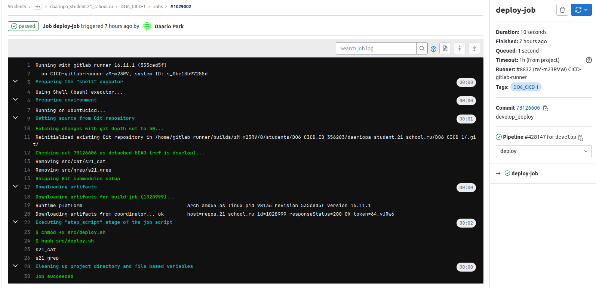
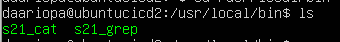

## Part 1. Настройка gitlab-runner  
- Поднимем виртуальную машину Ubuntu Server 22.04 LTS  
 
- Установка на виртуальную машину gitlab-runner   
    - Для его установки необходимо сначала настроить репозиторий:  
    `curl -L "https://packages.gitlab.com/install/repositories/runner/gitlab-runner/script.deb.sh" | sudo bash`  
      
    - Установим пакет:  
    `sudo apt-get install gitlab-runner`  
      
      
- Запустить gitlab-runner и зарегистрировать его для использования в текущем проекте (DO6_CICD)  
`sudo gitlab-runner register`   
  

## Part 2. Сборка  
Напишем этап для CI по сборке приложений из проекта C2_SimpleBashUtils:
- В файле .gitlab-ci.yml добавлен этап запуска сборки через мейк файл из проекта C2_SimpleBashUtils. Файлы, полученные после сборки (артефакты), сохраняться в директорию /src/* со сроком хранения 30 дней.  
  
    При первой сборке пайплайн «зафейлин», так как не хватало нужных пактов, после установки `sudo apt install gcc`, `sudo apt install make` сборка прошла успешно.
  
  

## Part 3. Тест кодстайла  
Напишем этап для CI, который запускает скрипт кодстайла (clang-format):  
- В файле .gitlab-ci.yml добавлен этап кодстайла:  
  
- Тест кодстайла пройден успешно  
  
  
- Проверка на кодстайл, eсли не пройден, то пайплайн «зафейлин» и отображение вывода утилиты clang-format:  
  
  

## Part 4. Интеграционные тесты  
Напишем этап для CI, который запускает интеграционные тесты из проекта C2_SimpleBashUtils:  
- В файле .gitlab-ci.yml добавлен этап тестирования. Запускается этот этап автоматически при условии, если сборка и тест кодстайла прошли успешно.   
  
  
В пайплайне отображается вывод, что интеграционные тесты прошли успешно.  

## Part 5. Этап деплоя   
Настраиваем виртуальные машины:  
- Поднимаем вторую виртуальную машину и настриваем сеть на тип соединения `сетевой мост`, чтобы виртуальные машины находились в локальной сети.
- Запрашиваем новые ip адреса для машин и пингуем их, чтобы проверить соединение   
   
- Переходим в юзера gitlab-runner `su gitlab-runner`  
- На нём генерируем ключ ssh `ssh-keygen`  
- Пробрасываем ключ серверу `ssh-copy-id daariopa@192.168.0.103`  
- Даём gitlab-runner прав sudo `usermod -aG sudo gitlab-runner`  
- На сервере(второй машине) даём права к директории /usr/local/bin `chmod +x /usr/local/bin`  

Допишем этап для CD, который «разворачивает» проект на другой виртуальной машине:  
- Прописываем bash-скрипт, который при помощи ssh и scp копирует файлы, полученные после сборки (артефакты), в директорию /usr/local/bin второй виртуальной машины  
    
- в файле gitlab-ci.yml добавим этап запуска написанного скрипта. Этап запускается вручную `when` при условии, что все предыдущие этапы прошли успешно `needs`   
  
- При успешном пайплайне этапа делпоя в гитлабе пайплайн будет отображаться следующим образом:  
  
- В результате получаем готовые к работе приложения из проекта C2_SimpleBashUtils (s21_cat и s21_grep) на второй виртуальной машине  
  

## Part 6. Дополнительно. Уведомления  
Настройка уведомления о успешном/неуспешном выполнении пайплайна через бота с именем «Daariopa DO6 CI/CD» в Telegram:   
- Создаем бота в Телеграм с помощью BotFather  
  
- Создаем скрипт telegram.sh, со следующим содержанием  
  
- Для получения id чата в браузере забиваем `https://api.telegram.org/bot<BOT_TOKEN>/getUpdates`, и отправляем любое сообщение в чат бота. На странице отобразятся данные, включая id чата в который отправили сообщение  
- Добавляем в файл gitlab-ci.yml зпуск скрипта после выполенения каждого этапа  
  
- Текст уведомления содержит информацию об успешности прохождения как этапа CI, так и этапа CD  

  
