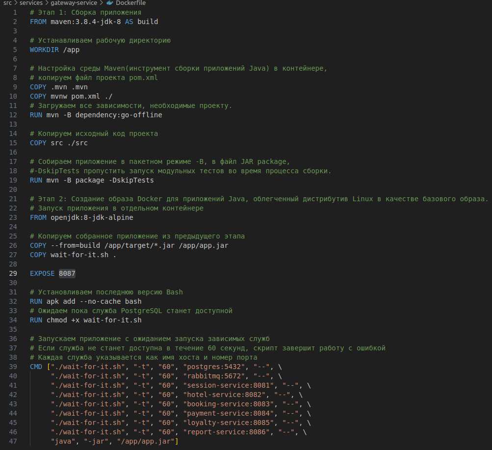
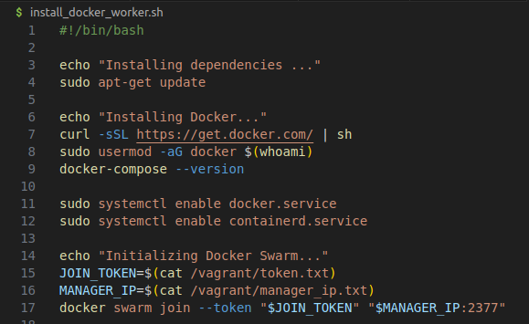

## Part 1. Запуск нескольких docker-контейнеров с использованием docker compose  
 1. Написаны Dockerfile для каждого отдельного микросервиса:
  - booking-service    
   
  - database    
   
  - gateway-service    
   
  - hotel-service    
   
  - loyalty-service    
   
  - payment -service    
   
  - report-service    
   
  - session-service    
   
 - Отображение размера собранных образов. В колонке size указан размер.  
  

2. Написан docker-compose файл, который осуществляет корректное взаимодействие сервисов. Весь файл можно просмотреть в docker-compose-patr1.txt.     
  

3. Собран и развернут веб-сервис `sudo docker compose up --build -d` с помощью написанного docker compose файла на локальной машине.  
  

4. Прогнаны заготовленные тесты через postman.   
  

## Part 2. Создание виртуальных машин  
1. Установливаем и инициализируем Vagrant `vagrant init` в корне проекта. Компания Vagrant заблокировала доступ к своим ресурсам из России и для написания Vagrantfile помогла эта статья -> https://habr.com/ru/articles/735700/    
  
- Создаём виртуальную машину `vagrant up` согласно описанию в Vagrantfile. 
  

2. Заходим через консоль внутрь виртуальной машины `ssh vagrant`, чтобы удостовериться, что исходный код веб-сервиса находится в рабочей директории виртуальной машины. При подключении у меня запрашивался пароль. В официальной документации Vagrant указано, что для пользователя 'vagrant' есть пароль по умолчанию, который `vagrant` сам по себе.   
  
- После остановливаем `vagrant halt` и уничтожаем `vagrant destroy` виртуальную машину.  
  

## Part 3. Создание простейшего docker swarm  
1. Модифицировать Vagrantfile для создания трех машин: manager01, worker01, worker02. 
  
- Прописаны shell-скрипты для установки docker внутрь машин, инициализации и подключения к docker swarm.  
 - для manager01  
  
 - для worker01, worker02  
   

2. Для загрузки образов на docker hub необходимо зарегистрироваться и авторизоваться с помощью `docker login` и для каждого образа проставить тэги `docker tag image-name username/image-name:tag` и отправить их в хранилище `docker push username/new-image-name:tag`.  
  
- Mодифицирован docker-compose файл для подгрузки расположенных на docker hub образов   

3. Запускаем виртуальные машины `vagrant up`.  
  
- Заходим в manager01 `vagrant ssh manager01`. Файл docker-compose уже есть в папке /vagrant для запуска стека сервисов.
  
- Запускаем стек сервисов, используя написанный docker-compose файл `sudo docker stack deploy -c docker-compose.yml services`  
  
- Проверяем наличие стэка `sudo docker stack ls`   
  

4. Написан конфигурационный файл nginx.conf, где настроен прокси на базе nginx для доступа к gateway service на порт 8087 и session service на порт 8081  
- Изменен файл docker-compose.yml(создана оверлейная сеть `overlay_network` для всех сервисов и добавлен сервис nginx)   
- Перезапускаем стек с nginx и проверяем список сервисов `sudo docker service ls`  
  

5. Чтобы запустить тесты через Postman подключаемся к виртуальной машине с утановкой туннелей между локальной и виртуальной машиной, чтобы не менять localhost на IP manager01 `vagrant ssh manager01 -- -L 8081:localhost:8081 -L 8087:localhost:8087`
  

6. Команды docker:
- Список всех сервисов `sudo docker service ls`  
  
- Список всех узлов в кластере Docker Swarm `sudo docker node ls`
  
- Список задач и узлов для services`sudo docker service ps services_session-services`  
  
- Список задач стека webservice, включая распределение по узлам  
  
- Распределение по узлам:
  - на manager01 `sudo docker service ps`
      
  - на worker01:  
      
  - на worker02:  
      

7. Установим portainer-agent-stack.yml на manager01 `curl -L https://downloads.portainer.io/portainer-agent-stack.yml \ -o portainer-agent-stack.yml`
Проверим содержимое файла  
  
- Запустим отдельным стеком Portainer внутри кластера `sudo docker stack deploy -c portainer-agent-stack.yml portainer`.  
  
Переподключимся к manager01 с пробросом портов для portainer `vagrant ssh manager01 -- -L 8000:localhost:8000 -L 9000:localhost:9000 -L 9443:localhost:9443`  
Регистрируемся portainer на localhost:9000  
  
  
- Визуализацию распределения задач по узлам с помощью Portainer  
  

